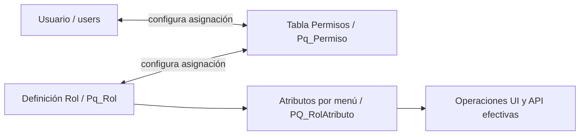
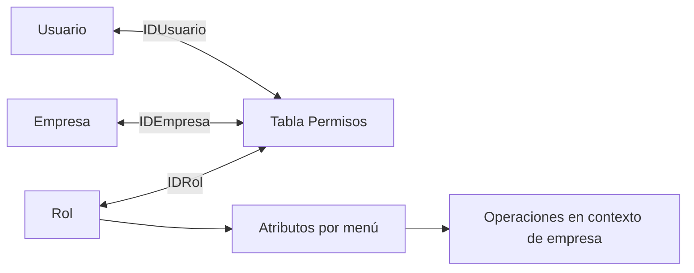
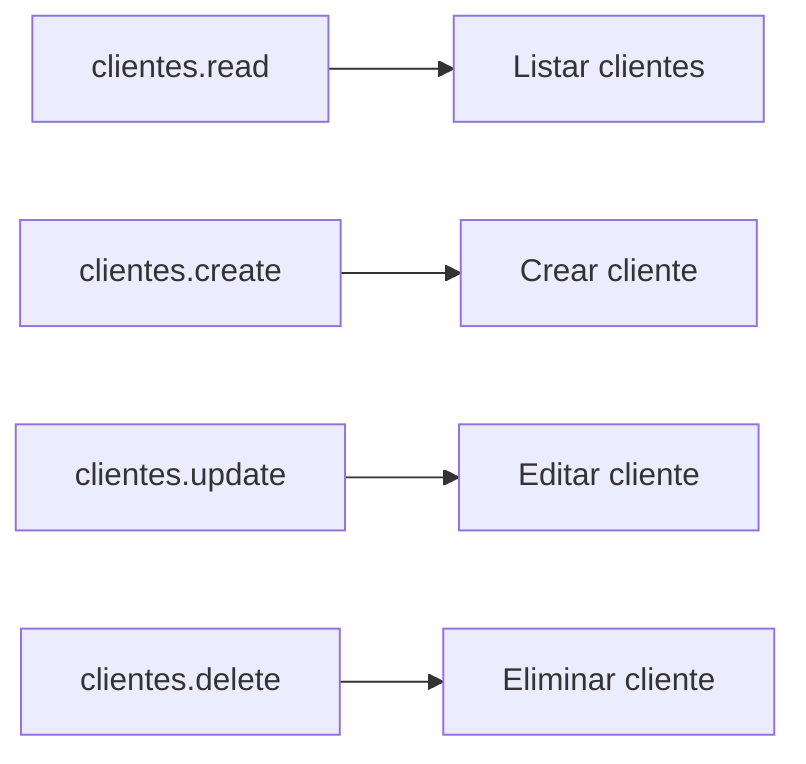
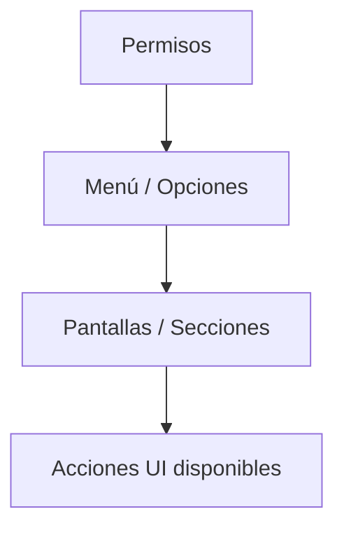
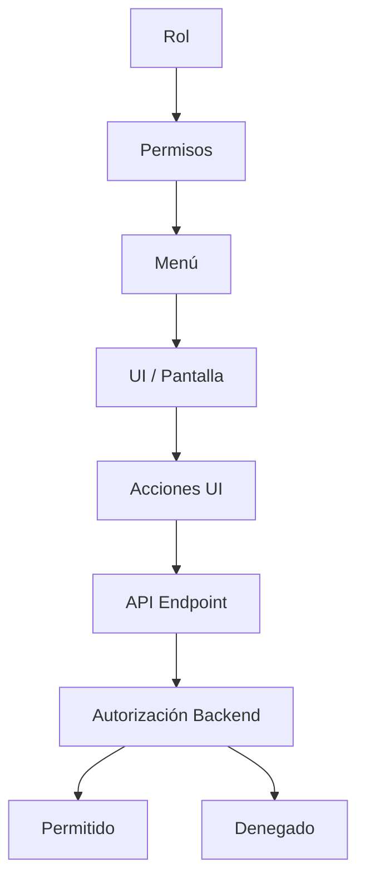
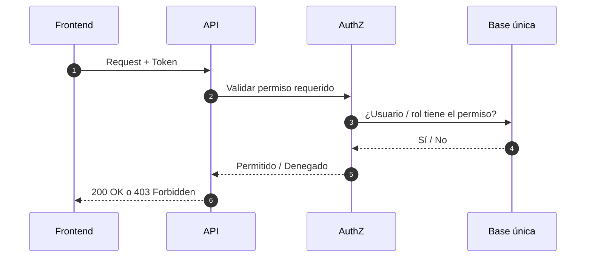
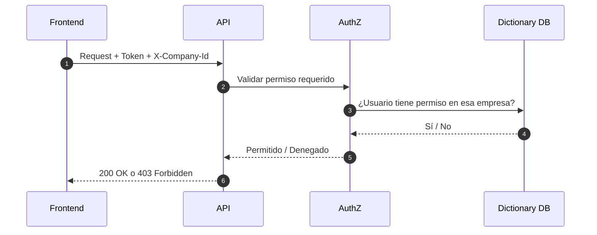

# Mapa Visual – Modelo de Seguridad (Roles → Permisos → Menú → Acciones)

## Propósito

Este documento muestra de forma visual cómo se modela y aplica la seguridad del ERP:

- Roles
- Permisos
- Menú
- Acciones (operaciones permitidas en API/UI)

Es un mapa rápido de arquitectura de seguridad.
No reemplaza especificaciones funcionales ni historias de usuario.

---

## 0) Alcance en **este** repositorio (modo **MONO**)

En **PaqSuite-IA-Partes-Atencion** el despliegue es **MONO** (mono-empresa): **no** hay tabla **empresa** para tenancy, **no** hay **`X-Company-Id`** ni asignación usuario–empresa en base de datos.

*(Ver declaración de modo en [`README.md`](./README.md) de esta carpeta.)*

Las secciones que siguen describen el **mismo espíritu** (autorización por operación, menú como vista, validación en API), pero el **modelo de datos** de seguridad se interpreta **sin dimensión empresa**. El flujo **multi-empresa** (usuario → empresa → rol) se deja como **referencia ERP** donde se indica explícitamente.

---

## 1) Concepto Central

### Modo **MONO** (esta versión)

> **Un usuario no “tiene acceso al sistema” en blanco: tiene permisos específicos sobre operaciones** (recurso.acción u homólogo) **en la única instalación / esquema.**

La autorización se evalúa **por operación**. No hay contexto de compañía que resolver antes del permiso.

### Referencia **MULTI** (otros productos / evolución futura)

> **Un usuario tiene permisos en el contexto de una empresa concreta** (tenant); la pertenencia usuario–empresa y el rol suelen modelarse por empresa.

---

## 2) Relación Visual: **Tabla Permisos** como asignación Usuario–Rol (**MONO**)

En el modelo de datos de referencia del stack PaqSuite, la **asignación usuario–rol** **no** es un pivote anónimo aparte: queda **configurada y persistida en la tabla de permisos** (p. ej. `Pq_Permiso`: vínculo **usuario + rol**; ver [`md-seguridad.md`](../modelo-datos/md-seguridad.md)).

Es decir: **cada fila de esa tabla expresa** “este usuario ejerce este rol” (en MONO, sin dimensión empresa operativa; la columna empresa del modelo legacy puede quedar **fija**, **neutra** o **homologada** según implementación). Los **permisos finos** por opción de menú / acciones suelen seguir en tablas de atributos del rol (p. ej. `PQ_RolAtributo` frente a `pq_menus`), no sustituyen el papel de **Pq_Permiso** como **quien amarra usuario y rol**.

Sin entidad **empresa** como tenant en el producto MONO:

Lectura del diagrama: **Usuario** y **Rol** se relacionan **solo** a través de la **tabla Permisos**; la definición del **rol** alimenta después la matriz menú/acción (**atributos**).

### Referencia **MULTI** (ERP multi-empresa)

La misma tabla de permisos incorpora la **empresa** en la clave: cada fila es **usuario + rol + empresa** (Dictionary DB).

---

## 3) Permisos como “Llaves de Acción”

---

## 4) Menú como “Vista del Sistema”, no como Seguridad

El menú es una representación navegable del sistema.
Principio:
El menú no concede permisos, solo refleja lo que el usuario podría ver según sus permisos.

Si el usuario no tiene permisos, una opción de menú no se muestra.
Pero la seguridad real siempre se valida en backend.

---

## 5) Cadena Completa: Roles → Permisos → Menú → Acciones → API

---

## 6) Validación en cada Request (Regla Innegociable)

### **MONO** — flujo en esta versión

En cada operación backend relevante:

1. **Autenticación** (token válido, p. ej. Sanctum).
2. **Validación de permiso** específico de la operación (sin paso previo por empresa).

No aplica: selección de empresa, `X-Company-Id`, ni consulta de pertenencia usuario→empresa.

### Referencia **MULTI** — flujo ERP

En cada operación de gestión suele evaluarse:

1. Autenticación (token válido).
2. **Empresa activa** (p. ej. header `X-Company-Id`).
3. Pertenencia **usuario → empresa**.
4. Permiso específico **en esa empresa**.

---

## 7) Patrones de Permisos Recomendados

### 7.1 Permisos por Recurso + Acción (estándar)

* Formato: {recurso}.{accion}
* Ejemplos:
clientes.read
clientes.create
* Ventaja:
Escala bien
Es predecible
Se documenta fácil

### 7.2 Permisos especiales (cuando aplique)

* Ejemplos:
clientes.export
clientes.manage-credit
admin.security.manage
* Regla:
Solo cuando la acción no es un CRUD estándar.

---

## 8) Resumen en 60 segundos (**MONO**)

La **tabla de permisos** (p. ej. `Pq_Permiso`) **configura** qué **rol** tiene cada **usuario** en la instalación.
La **definición del rol** y los **atributos por menú** determinan qué operaciones puede efectuar.
Los permisos “de acción” del §3 (recurso.acción) pueden mapearse a reglas de API además del modelo menú/atributos.
El menú **refleja** capacidades, pero **no** es seguridad real.
La API **valida** en cada request.
**No** hay tabla **empresa** como tenant en esta versión: **un único esquema** (la columna empresa del modelo legacy puede quedar fija u omitirse según implementación).

### Una línea (referencia **MULTI**)

Usuario–empresa–rol–permisos; contexto de empresa (p. ej. `X-Company-Id`); Dictionary vs Company DB según arquitectura ERP.

---

## Regla Fundamental

La **tabla de permisos** materializa la **asignación usuario–rol** (y empresa en MULTI).
El rol organiza **atributos** y capacidades sobre menú / procesos.
El permiso (como regla de negocio o recurso.acción) **autoriza acciones** en API.
**MONO:** sin tenant por empresa; el menú y la API se alinean a la instalación única.
El menú refleja capacidades del rol; la API valida en cada request.
