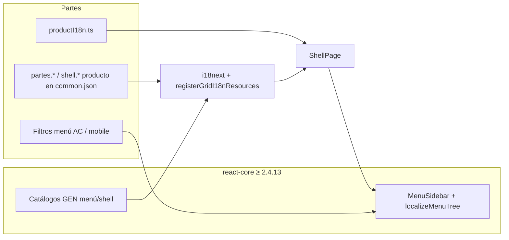

# Plan — Partes: adopción SDK sin forks GEN (grillas, menú, i18n)

| Campo | Valor |
|-------|--------|
| **Producto** | PaqSuite-IA-Partes-Atencion (MONO) |
| **Estado del plan** | En ejecución — bump local y wiring de grilla verificados; menú/shell pendiente de export SDK |
| **SDK objetivo** | `@paqsuite/react-core` **2.4.14** (repo-lab local; grid i18n disponible) · `paqsuite/laravel-core` **1.3.8** (sin cambio funcional esperado) |
| **Scaffold referencia** | `@paqsuite/create-app` **0.1.13** (template shell/menú i18n) |
| **Norma** | Regla **19** — adoptar GEN, no reimplementar · GEN-11 grillas · GEN-02 i18n · GEN-07 menú |

Documento relacionado: [integracion-framework-sdk.md](./integracion-framework-sdk.md) · ritual bump: [ritual-bump-sdk.md](./ritual-bump-sdk.md) · deploy: [deploy-sdk-package-repos.md](./deploy-sdk-package-repos.md).

---

## 1. Resumen ejecutivo

El host Partes acumuló **forks** de capacidades GEN (totalizadores de grilla, catálogos `grid.summary.*`, `shellI18n.ts` duplicando `menu.*`, cableado manual de `summaryTypeLabels` en cada `ProcessDataGrid`). Framework publicó en **react-core** la centralización de **i18n de grillas** y adaptaciones de **menú/shell** alineadas al scaffold **create-app 0.1.13**.

**Objetivo:** dejar en Partes solo **dominio** (kardex, textos `partes.*`, `productI18n` / `menu.{codigo}`, permisos de menú, pies de duración horas/minutos) y consumir el SDK conforme a buenas prácticas, **sin forks GEN**.

**Ejecución:** por fases (bump → wiring i18n grilla → limpieza menú/shell → auditoría grillas → verificación). Parte del trabajo de totalizadores GEN ya está preparado en working tree local; el documento describe el cierre completo.

---

## 2. Entrega Framework (react-core)

### 2.1 Grillas — i18n GEN (`grid.summary.*`)

Framework incorporó catálogo y registro de recursos i18n para `ProcessDataGrid` (menú contextual de pie, etiquetas de totalizadores, integración con instancia i18next del host).

**Archivos principales en Framework** (`packages/js/react-core/src/`):

| Archivo | Rol |
|---------|-----|
| `i18n/gridI18n.ts` | Catálogo GEN `grid.summary.*` (5 locales) |
| `i18n/gridI18nInstance.ts` | Registro en la instancia i18next del host |
| `ui/grid/ProcessDataGrid.tsx` | Consume i18n GEN (sin obligar `summaryTypeLabels` en el host) |
| `ui/grid/DataGridDx.tsx` (o equivalente) | Alineación con el mismo contrato de grillas |

**Export esperado en el host:**

```typescript
import { registerGridI18nResources, syncDevExtremeLocale } from '@paqsuite/react-core'
```

### 2.2 Menú + shell i18n (create-app 0.1.13)

Release asociado: template con **shell/menú i18n** unificado (catálogos GEN de sidebar, traductor de menú, patrón de merge con catálogo de producto). Detalle exacto de exports: **validar en bump** contra `node_modules/@paqsuite/react-core/src/index.ts` y el template `@paqsuite/create-app@0.1.13`.

### 2.3 Backend

`paqsuite/laravel-core` **1.3.8** en Satis — refresh de catálogo; sin cambios de contrato Partes salvo changelog del release.

---

## 3. Instrucciones Partes **después del bump** (Framework)

Checklist obligatorio tras instalar `@paqsuite/react-core` ≥ 2.4.13:

### 3.1 Registrar i18n de grilla en la instancia i18next

En `frontend/src/i18n/i18n.ts`, **después** de `i18n.init(...)`:

```typescript
import {
  getGuestLocale,
  normalizeLocale,
  registerGridI18nResources,
  setGuestLocale,
  syncDevExtremeLocale,
  type LocaleCode,
} from '@paqsuite/react-core'

// … init i18n …

registerGridI18nResources(i18n)
syncDevExtremeLocale(initialLocale)
```

En `applyGuestLocale`, mantener `syncDevExtremeLocale(next)` **después** de `changeLanguage` (ya existe; no duplicar llamadas inconsistentes).

### 3.2 Dependencias

- **`i18next`** y **`react-i18next`**: Partes **ya las tiene** en `frontend/package.json`. Acción: **verificar** versión compatible con peer del SDK; no duplicar instalación sin necesidad.

### 3.3 Quitar workarounds manuales de totalizadores GEN

| Eliminar / no reintroducir | Motivo |
|----------------------------|--------|
| `usePartesGridSummaryTypeLabels` | GEN en SDK |
| Prop `summaryTypeLabels` en cada `ProcessDataGrid` | GEN en SDK |
| Claves `grid.summary.*` en `frontend/src/i18n/locales/*/common.json` | GEN en SDK vía `registerGridI18nResources` |

**Conservar (dominio Partes):**

| Mantener | Motivo |
|----------|--------|
| `partesGridSummary.ts` — hooks `usePartesDuracionHorasSummaryItems`, `usePartesMinutosColumnSummaryItems` | Formato horas decimales / `hh:mm` en columnas de negocio |
| Clave `partes.grid.summary.hoursSuffix` en JSON del host | Sufijo de presentación producto |
| `defaultTotalItems` / `columnSummaryFormatters` donde aplique | Configuración de columna dominio, no menú GEN |

Refinamiento opcional post-registro: reducir hooks de dominio a `columnSummaryFormatters` + items mínimos si el SDK cubre prefijos traducidos.

### 3.4 Menú / producto — **sin cambio de alcance**

- **`productI18n.ts`** (`menu.{codigo}` de `pq_menus`) — **permanece en el host**.
- Filtros de menú Partes (`PartesMenuSidebar`, mobile policy, AC cliente/supervisor) — **permanecen**.
- La limpieza de **`shellI18n.ts`** (fork GEN duplicado) es fase **posterior** del plan §4.2; no sustituye `productI18n.ts`.

---

## 4. Estado actual en el repositorio Partes (pre-ejecución formal)

| Ítem | Estado |
|------|--------|
| Eliminación `summaryTypeLabels` + `grid.summary.*` en locales | Preparado en working tree (pendiente commit) |
| `partesGridSummary.ts` reducido a dominio duración | Preparado en working tree |
| `registerGridI18nResources` en `i18n.ts` | **Verificado** con `@paqsuite/react-core` 2.4.14 y namespace `common` |
| Pin `package.json` | `file:../../PaqSuite-IA-FRAMEWORK/packages/js/react-core`; lock resuelve **2.4.14** |
| `shellI18n.ts` fork menú GEN | **Pendiente/bloqueado**: 2.4.14 no exporta `createAppTranslator` ni `buildMenuSidebarLabels`; no eliminar sin contrato SDK |
| Registry / release empaquetado | Repo-lab resuelto localmente; queda pendiente publicar artefacto versionado/tarball para Vercel |

---

## 5. Fases de implementación

### Fase 0 — Baseline y bump SDK

| # | Tarea |
|---|--------|
| 0.1 | Red a `srv-pq` (Tailscale): `npm install @paqsuite/react-core@2.4.13` (o última publicada con grid i18n). Actualizar `package.json`, `package-lock.json`. |
| 0.2 | `npm pack @paqsuite/react-core --pack-destination vendor` → actualizar `frontend/scripts/vercel-install.sh` (tarball vendored para Vercel). |
| 0.3 | Diff exports: `src/index.ts` vs template **create-app 0.1.13** (`ShellPage`, `i18n.ts`). Anotar nombres reales de helpers menú/shell. |
| 0.4 | Backend: `composer install` / verificar lock `paqsuite/laravel-core` **1.3.8**. |
| 0.5 | Actualizar [ritual-bump-sdk.md](./ritual-bump-sdk.md) con pins nuevos. |

**Criterio de salida:** build FE + `npm run typecheck` con SDK nuevo.

---

### Fase 1 — Grillas GEN-11 / i18n pie (§3 completo)

| # | Tarea |
|---|--------|
| 1.1 | Aplicar §3.1 `registerGridI18nResources(i18n)`. |
| 1.2 | Confirmar ninguna pantalla pasa `summaryTypeLabels`. |
| 1.3 | Smoke: cambiar idioma → clic derecho en celda de pie → textos `grid.summary.*` traducidos (no español fijo de `DEFAULT_GRID_SUMMARY_TYPE_LABELS`). |
| 1.4 | Tests: `partesGridSummary.test.ts` (dominio); regresión unit en pantallas si aplica. |

**Pantallas con `ProcessDataGrid` (referencia):** Carga diaria, Proceso masivo, Consultas, Paquete horas, Dashboard, Maestros (`MaestroCrudPage`, `ClienteTiposTareaPage`), Admin seguridad (sin reintroducir forks).

---

### Fase 2 — Menú + shell i18n (GEN-07 / GEN-02)

**Problema:** triple fuente hoy — `shellI18n.ts`, claves `menu.*` en `common.json`, fallback en `PartesMenuSidebar`.

**Estado objetivo:**



| # | Tarea |
|---|--------|
| 2.1 | Eliminar `frontend/src/features/auth/shellI18n.ts`. |
| 2.2 | Importar desde SDK el patrón del template 0.1.13 (`createAppTranslator`, `buildMenuSidebarLabels`, catálogos o merge en `i18n.ts`). |
| 2.3 | Quitar de `common.json` claves `menu.controls`, `menu.toggle*`, `menu.searchPlaceholder`, etc., **solo** si el catálogo GEN del SDK las cubre. |
| 2.4 | `ShellPage`: un traductor outlet = SDK + overlay `productI18nCatalogs[locale]`. |
| 2.5 | `PartesMenuSidebar`: quitar fallback local `t('menu.*')`; recibir `labels` + `t` desde shell. |
| 2.6 | Actualizar `partesMenuI18n.test.ts` (import traductor desde SDK). |

**No tocar:** `productI18n.ts` (salvo mover rutas de import si cambia el módulo SDK).

---

### Fase 3 — Título de proceso (GEN-07)

| # | Tarea |
|---|--------|
| 3.1 | Si SDK exporta `useProcessMenuTitle`: borrar `useProcessMenuTitle.ts` del host y actualizar imports. |
| 3.2 | Si no está exportado: ticket Framework; hook mínimo importando tipos/traductor del SDK (sin `shellI18n` local). |
| 3.3 | Tipo `ShellOutletContext`: re-export SDK o módulo fino de tipos. |

---

### Fase 4 — Props GEN en `ProcessDataGrid`

Auditar cada uso y **eliminar** props que dupliquen defaults traducidos del SDK:

- `emptyGroupPanelText`, `columnChooserTitle`, `createHint`, `loadingLabel`, labels export/layouts.

Solo pasar overrides con claves **producto** (`partes.*`) vía `t()` cuando HU/TR lo exija.

---

### Fase 5 — i18n global del host

| # | Tarea |
|---|--------|
| 5.1 | Merge recursos GEN SDK (login, envelope, grid vía `registerGridI18nResources`, menú si aplica) + JSON host solo producto. |
| 5.2 | Auditar duplicados `login.*` vs `loginI18nCatalogs` del SDK. |
| 5.3 | Envelope: usar `translateEnvelopeRespuesta` / `resolveApiClientMessage`; evitar duplicar en `authMessages`. |

---

### Fase 6 — Alcance que **no** se mueve al SDK (dominio legítimo)

| Área | Motivo |
|------|--------|
| `PartesMenuSidebar` filtros cliente / supervisor / mobile | Reglas AC Partes |
| `partesMobilePolicy`, kardex, mappers | GEN-22 + dominio |
| `partesTareaGridI18n`, `partesFiltroEstado` | Negocio |
| `partesGridSummary` (duración) | Formato horas/minutos |
| `emissionHostContextBridge`, `installApiAuthFetch` | GEN-15 + auth host |
| `partesLlmProviderCatalog`, `PartesProfilePanel`, `partesAuthHero` | Config / branding |
| `ThemeProvider`, `empresaThemeCatalog` | Tema A1 empresa |

---

### Fase 7 — Verificación y Definition of Done

**Comandos:**

```bash
cd frontend
npm run typecheck
npm run test
npm run test:e2e   # smoke mínimo acordado
npm run build:mobile   # si tocó mobile
```

**Smoke manual:**

1. Login → shell → cambio de idioma (5 locales).
2. Menú sidebar: labels GEN + ítems `label_key` vía `productI18n`.
3. Una grilla con pie: menú contextual traducido + total dominio duración.
4. Health / una API tras bump BE si aplica.

**DoD “sin fork GEN”:**

- [ ] `@paqsuite/react-core` ≥ 2.4.13 pinneado + tarball Vercel actualizado.
- [ ] `registerGridI18nResources(i18n)` en `i18n.ts`.
- [ ] No existe `shellI18n.ts` en el host (fase 2).
- [ ] No hay `grid.summary.*` en JSON del host.
- [ ] Ningún `ProcessDataGrid` con `summaryTypeLabels`.
- [ ] `productI18n.ts` solo catálogo menú producto (+ lo definido en TR).
- [ ] Documentación de pins actualizada.

---

## 6. Orden de ejecución recomendado

1. **Fase 0** — bump + diff template.
2. **Fase 1** — §3 Framework (grid i18n) + cierre workarounds.
3. **Fase 2 + 3** — menú/shell/títulos (mayor reducción de deuda).
4. **Fase 4 + 5** — props grilla + merge i18n global.
5. **Fase 7** — tests y smoke.

Estimación: **1–2 días** FE si exports del template están completos; **+0,5 día** si falta export en SDK (patch 2.4.14).

---

## 7. Riesgos y mitigaciones

| Riesgo | Mitigación |
|--------|------------|
| Vercel sin Verdaccio | Tarball `vendor/paqsuite-react-core-*.tgz` |
| Versión 2.4.13 no visible en registry | Verificar publicación Verdaccio antes de Fase 0 |
| Regresión idioma menú | `partesMenuI18n.test.ts` + E2E cambio locale |
| Pies duración con prefijo no traducido | Tras Fase 1, validar prefijo vía i18n GEN; sufijo `partes.grid.summary.hoursSuffix` en host |
| Duplicado login/envelope | Fase 5 audit clave a clave |

---

## 8. Trazabilidad OpenSpec / GEN

| GEN | Tema | Acción en este plan |
|-----|------|---------------------|
| GEN-02 | i18n | `registerGridI18nResources`, merge catálogos, eliminar `shellI18n` |
| GEN-07 | Menú | Sidebar labels + `productI18n` + filtros host |
| GEN-11 | Grillas | `ProcessDataGrid` sin forks de totalizadores |
| GEN-19 | Shell | Sin reimplementar layout; solo wiring i18n |
| Regla 19 | Adopción | No copiar carpetas GEN al host |
| Regla **43** (`40-i18n/43-host-sdk-i18n-sin-fork-gen.mdc`) | i18n SDK transversal | Ritual bump + `registerGridI18nResources` + anti-fork grilla/shell GEN (hosts) |

---

## 9. Historial

| Fecha | Nota |
|-------|------|
| 2026-09-23 | Plan inicial: revert totalizadores GEN, auditoría forks, instrucciones Framework post-2.4.13 (`registerGridI18nResources`). Pendiente orden de ejecución. |
| 2026-09-23 | Regla BASE **43** + enlaces en reglas 19, 29, 42 (criterio transversal hosts SDK). |
| 2026-09-23 | Inicio Fase 0+1: registry sin 2.4.13/1.3.8; Fase 1 prep en host (sin `summaryTypeLabels` / sin `grid.summary.*` GEN); pendiente `registerGridI18nResources` tras bump. |

---

**Próximo paso:** completar smoke F1 mobile y elevar al Framework el faltante de exports de menú/shell antes de retirar `shellI18n.ts`.

### 2026-09-24 — cierre parcial de alineación

- `@paqsuite/react-core` 2.4.14 verificado desde el checkout local del Framework.
- `registerGridI18nResources(i18n, 'common')` y `syncDevExtremeLocale` ya están cableados en `frontend/src/i18n/i18n.ts`.
- `ShellPage` usa `MenuAuthProvider`, `locale`, `t`, `labels` y `onItemsLoaded` conforme a las reglas 42/43.
- La eliminación de `shellI18n.ts` queda bloqueada hasta que el SDK/template publique los helpers equivalentes; el host no inventa una API ni duplica una migración incompleta.
