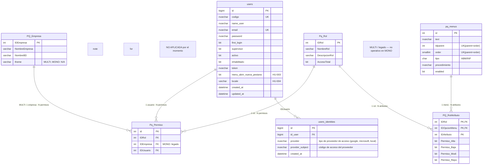
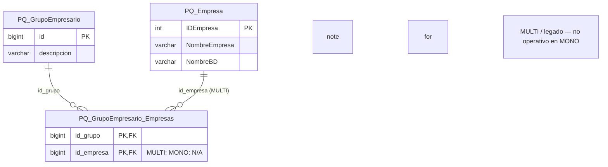
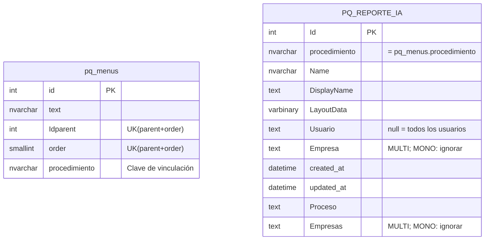
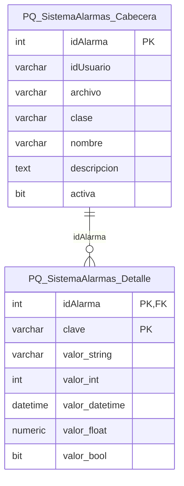
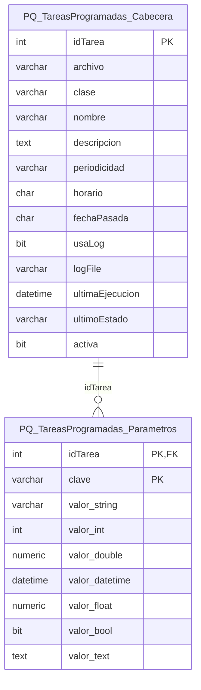

# Diagramas Mermaid – Base de Datos PQ_DICCIONARIO

Este archivo contiene los diagramas de entidad-relación en formato Mermaid para la base de datos **PQ_DICCIONARIO** (Dictionary DB).

> **Instalación MONO (PaqSuite-IA-Partes-Atencion):** Las entidades **`PQ_Empresa`**, relaciones **empresa ↔ `Pq_Permiso`** y el módulo **GRUPOS EMPRESARIOS** son **referencia MULTI / legado**. En el producto actual la autorización es **usuario–rol** sin contexto de compañía. En los diagramas siguen apareciendo para no romper documentación de migración; prestá atención a las **notas** `MONO` / `MULTI`.

**Origen:** Los diagramas se derivan de los comandos CREATE TABLE y las definiciones en `md-seguridad.md`.

**Archivos relacionados:**
- `md-seguridad.md` – DDL + definiciones por módulo
- `md-seguridad-diagramas.md` – Este archivo: diagramas Mermaid

**Tablas no aplicadas:** La tabla `users_identities` no se implementa por el momento. Ver `md-seguridad.md` sección "Tablas no aplicadas".

---

## 1. Diagrama general (todas las tablas)

Vista consolidada de todas las entidades del diccionario y sus relaciones.

```mermaid
erDiagram
    users {
        bigint id PK
        nvarchar codigo UK "Código único usuario"
        nvarchar name_user "Nombre y apellido"
        nvarchar email UK
        nvarchar password "Contraseña encriptada"
        bit first_login "Debe cambiar en 1er login"
        bit supervisor
        bit activo
        bit inhabilitado
        nvarchar token "Validación APIs"
        bit menu_abrir_nueva_pestana "0=misma pestaña, 1=nueva (HU-003)"
        varchar locale "es, en, etc. NULL=browser (HU-004)"
        datetime created_at
        datetime updated_at
    }

    users_identities{
        bigint id PK
        bigint id_user
        nvarchar provider           "tipo de proveedor de acceso  (google, microsoft, local)"
        nvarchar provider_subject   "código de acceso del proveedor"
        datetime created_at
    }
    note for users_identities "NO APLICADA por el momento"

    pq_menus {
        int id PK
        nvarchar text "Descripción en pantalla"
        bit expanded
        int Idparent "0 = rama principal, UK(parent+order)"
        smallint order "UK(parent+order)"
        char tipo "ABM / INF / ..."
        nvarchar procedimiento "Vincula APIs, reportes"
        bit enabled
        varchar routeName
        int estructura
    }
    
    PQ_Empresa {
        int IDEmpresa PK
        varchar NombreEmpresa "Nombre visual"
        varchar NombreBD "Company DB (MULTI)"
        int Habilita
        varchar imagen
        varchar theme "MULTI: tema por empresa; MONO: N/A"
    }
    note for PQ_Empresa "MULTI / legado — no operativo en MONO"
    
    Pq_Rol {
        int IDRol PK
        varchar NombreRol "Código rol"
        varchar DescripcionRol
        bit AccesoTotal "Supervisor"
    }
    
    PQ_RolAtributo {
        int IDRol PK,FK
        int IDOpcionMenu PK,FK
        int IDAtributo PK
        bit Permiso_Alta
        bit Permiso_Baja
        bit Permiso_Modi
        bit Permiso_Repo
    }
    
    Pq_Permiso {
        int id PK
        int IDRol FK
        int IDEmpresa FK "MONO: legado; MULTI: empresa"
        int IDUsuario FK
    }
    note for Pq_Permiso "MONO: permiso = usuario + rol (IDEmpresa no usada en reglas)"
    
    pq_grid_layouts {
        bigint id PK
        bigint user_id FK "Usuario creador"
        varchar proceso "pq_menus.procedimiento"
        varchar grid_id "default, master, detalle..."
        varchar layout_name
        nvarchar layout_data "JSON"
        bit is_default
        datetime created_at
        datetime updated_at
    }
    
    PQ_GrupoEmpresario {
        bigint id PK
        varchar descripcion
    }
    note for PQ_GrupoEmpresario "MULTI / legado — no operativo en MONO"
    
    PQ_GrupoEmpresario_Empresas {
        bigint id_grupo PK,FK
        bigint id_empresa PK,FK "MULTI; MONO: N/A"
    }
    
    PQ_REPORTE_IA {
        int Id PK
        nvarchar procedimiento "Vincula pq_menus.procedimiento"
        nvarchar Name
        text DisplayName
        varbinary LayoutData
        text Usuario "null = todos"
        text Empresa "MULTI; MONO: ignorar"
        datetime created_at
        datetime updated_at
        text Proceso
        text Empresas "MULTI; MONO: ignorar"
    }
    
    PQ_SistemaAlarmas_Cabecera {
        int idAlarma PK
        varchar idUsuario
        varchar archivo
        varchar clase
        varchar nombre
        text descripcion
        bit activa
    }
    
    PQ_SistemaAlarmas_Detalle {
        int idAlarma PK,FK
        varchar clave PK
        varchar valor_string
        int valor_int
        datetime valor_datetime
        numeric valor_float
        bit valor_bool
    }
    
    PQ_TareasProgramadas_Cabecera {
        int idTarea PK
        varchar archivo
        varchar clase
        varchar nombre
        text descripcion
        varchar periodicidad
        char horario
        char fechaPasada
        bit usaLog
        varchar logFile
        datetime ultimaEjecucion
        varchar ultimoEstado
        bit activa
    }
    
    PQ_TareasProgramadas_Parametros {
        int idTarea PK,FK
        varchar clave PK
        varchar valor_string
        int valor_int
        numeric valor_double
        datetime valor_datetime
        numeric valor_float
        bit valor_bool
        text valor_text
    }
    
    users ||--o{ Pq_Permiso : "IDUsuario"
    users ||--o{ users_identities : "IDUsuario"
    users ||--o{ pq_grid_layouts : "user_id"
    PQ_Empresa ||--o{ Pq_Permiso : "IDEmpresa (MULTI)"
    Pq_Rol ||--o{ Pq_Permiso : "IDRol"
    Pq_Rol ||--o{ PQ_RolAtributo : "IDRol"
    pq_menus ||--o{ PQ_RolAtributo : "IDOpcionMenu"
    PQ_GrupoEmpresario ||--o{ PQ_GrupoEmpresario_Empresas : "id_grupo"
    PQ_Empresa ||--o{ PQ_GrupoEmpresario_Empresas : "id_empresa (MULTI)"
    PQ_SistemaAlarmas_Cabecera ||--o{ PQ_SistemaAlarmas_Detalle : "idAlarma"
    PQ_TareasProgramadas_Cabecera ||--o{ PQ_TareasProgramadas_Parametros : "idTarea"
```

> **Nota MONO:** La relación dibujada entre `PQ_Empresa` y `Pq_Permiso` refleja el **modelo legado MULTI**. En este producto, el menú y los permisos efectivos se resuelven por **usuario y rol** sin empresa activa.

> **Nota:** `PQ_REPORTE_IA` se vincula lógicamente a `pq_menus` mediante el campo `procedimiento` (no hay FK física).

---

## 2. Módulo SEGURIDAD

**Objetivo (MONO):** Autenticación y autorización por **usuario y rol**; permisos por opción de menú. **Sin** empresa activa ni `PQ_Empresa` operativa.

**Objetivo (MULTI — legado):** Incluye acceso por **empresa** y relación `PQ_Empresa` ↔ `Pq_Permiso`.

**Relaciones:**
- **MONO:** 1 fila de `Pq_Permiso` → **1 usuario + 1 rol** (`IDEmpresa` legada, no usada en reglas).
- **MULTI:** 1 permiso → 1 usuario + **1 empresa** + 1 rol.
- 1 rol → varios `PQ_RolAtributo` (1 por opción de menú)
- 1 rol atributo → 1 opción de menú

> **MONO:** El vínculo `PQ_Empresa`–`Pq_Permiso` es **solo documental** (legado MULTI). Operativamente: **usuario + rol**.

---

## 3. Módulo GRUPOS EMPRESARIOS

> **MONO:** Módulo **no operativo** en PaqSuite-IA-Partes-Atencion. Diagrama y texto siguientes = **referencia MULTI / legado**.

**Objetivo (MULTI):** Agrupaciones de empresas para informes o procesos sobre **varias** bases de datos.

**Relaciones:**
- 1 grupo empresario → varias filas en `PQ_GrupoEmpresario_Empresas`
- Cada fila enlaza el grupo con un identificador de empresa del catálogo multi-empresa

> **Nota:** En el CREATE, `id_empresa` es `bigint` mientras `PQ_Empresa.IDEmpresa` es `int`. Revisar consistencia de tipos si se implementan FKs. En **MONO**, no aplicar este módulo.

---

## 4. Módulo REPORTES

**Objetivo:** Almacenar formatos, grillas, reportes y gráficos definidos por usuarios en informes o procesos con información masiva. Los campos **`Empresa` / `Empresas`** solo tienen sentido en **MULTI**; en **MONO** deben quedar sin uso operativo (`NULL` / ignorar).

**Relaciones:**
- 1 opción menu.procedimiento → varios reportes (vinculación lógica por nombre, no FK)

> **Nota:** La vinculación entre `pq_menus` y `PQ_REPORTE_IA` es **lógica** mediante el campo `procedimiento` (mismo valor en ambos). No existe FK física.

---

## 5. Módulo SISTEMA ALARMAS

**Objetivo:** Almacenar procesos que se disparan al activarse determinados eventos.

**Relaciones:** Cabecera → Detalle (parámetros de la alarma).

---

## 6. Módulo TAREAS PROGRAMADAS

**Objetivo:** Almacenar procesos a ejecutar en frecuencias definidas por usuarios, con valores predefinidos y opción de proceso manual análogo.

**Relaciones:** Cabecera → Parámetros.

---

## Resumen de módulos

| Módulo | Tablas | Estado relaciones |
|--------|--------|-------------------|
| **SEGURIDAD** | users, pq_menus, **PQ_Empresa** (MULTI ref.), Pq_Rol, PQ_RolAtributo, Pq_Permiso | **MONO:** permiso = usuario + rol; empresa N/A |
| **GRUPOS EMPRESARIOS** | PQ_GrupoEmpresario, PQ_GrupoEmpresario_Empresas, **PQ_Empresa** | **MULTI ref.;** no operativo MONO |
| **REPORTES** | pq_menus, PQ_REPORTE_IA | Lógica por procedimiento |
| **SISTEMA ALARMAS** | PQ_SistemaAlarmas_Cabecera, PQ_SistemaAlarmas_Detalle | Cabecera-Detalle |
| **TAREAS PROGRAMADAS** | PQ_TareasProgramadas_Cabecera, PQ_TareasProgramadas_Parametros | Cabecera-Parámetros |
