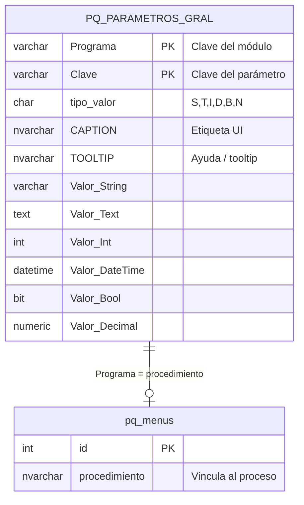

# PQ_PARAMETROS_GRAL – Parámetros generales por módulo

**Contexto:** Ver `docs/00-contexto/05-parametros-generales.md` para el objetivo y reglas de uso.

**Ubicación:** Esta tabla se crea en la **base de datos de cada empresa** (Company DB), **no** en el diccionario (PQ_DICCIONARIO). Cada empresa tiene su propia instancia de esta tabla.

Almacena valores configurables por módulo. Cada módulo define sus claves en la HU de parámetros; el proceso de mantenimiento (HU-007) permite solo editar valores (`Valor_*`), no agregar ni eliminar registros.

---

## CREATE TABLE (SQL Server) – Company DB (estado actual)

Tras la migración `2026_04_18_100000_rename_caption_texto_to_caption_tooltip_pq_parametros_gral`, las columnas de metadatos de presentación se nombran **`CAPTION`** y **`TOOLTIP`** (tipo **NVARCHAR(MAX)** NULL). Versiones anteriores usaban `Caption` / `Texto`; la API sigue leyendo ambos casings durante la transición.

```sql
CREATE TABLE [dbo].[PQ_PARAMETROS_GRAL](
	[Programa] [varchar](50) NOT NULL,
	[Clave] [varchar](50) NOT NULL,
	[tipo_valor] [char](1) NULL,
	[CAPTION] [nvarchar](max) NULL,
	[TOOLTIP] [nvarchar](max) NULL,
	[Valor_String] [varchar](255) NULL,
	[Valor_Text] [text] NULL,
	[Valor_Int] [int] NULL,
	[Valor_DateTime] [datetime] NULL,
	[Valor_Bool] [bit] NULL,
	[Valor_Decimal] [numeric](24, 6) NULL,
 CONSTRAINT [PK_PQ_PARAMETROS_GRAL] PRIMARY KEY CLUSTERED 
(
	[Programa] ASC,
	[Clave] ASC
)
)
```

---

## Diagrama ER



> **Nota:** `pq_menus` está en el diccionario; la relación es lógica (`Programa` = `procedimiento`).

---

## Mapeo tipo_valor → columna

| tipo_valor | Columna        | Tipo SQL     |
|------------|----------------|--------------|
| S          | Valor_String   | varchar(255) |
| T          | Valor_Text     | text         |
| I          | Valor_Int      | int          |
| D          | Valor_DateTime | datetime     |
| B          | Valor_Bool     | bit          |
| N          | Valor_Decimal  | numeric(24,6)|

---

## API (camelCase) y seed JSON

- **Listado / respuesta PUT:** cada ítem incluye `caption` y `tooltip` (mapeo desde `CAPTION` / `TOOLTIP` en BD). El PUT de valor **no** modifica `CAPTION` ni `TOOLTIP`; se mantienen vía seed o scripts.
- **Seed:** `docs/backend/seed/PQ_PARAMETROS_GRAL/PQ_PARAMETROS_GRAL.seed.json` usa las claves **`caption`** y **`tooltip`**. El seeder `PqParametrosGralSeeder` acepta también la clave legacy **`texto`** en JSON y la trata como `TOOLTIP`.

---

## Acceso desde la aplicación

- Solo lectura/escritura de **valores** vía API contra la conexión **`company`**, con el nombre de BD del tenant según **`X-Company-Id`** (middleware de empresa).
- **UI:** el listado muestra **`caption`** como etiqueta principal (y la **clave** como referencia si no hay caption); **`tooltip`** alimenta `title` en fila y el bloque de ayuda en el modal. El valor efectivo se muestra como **texto** homogéneo; la edición usa el control adecuado al `tipo_valor` (HU-007, regla 32 del repo).

## Referencias

- `docs/00-contexto/05-parametros-generales.md` – Objetivo y reglas
- `docs/03-historias-usuario/000-Generalidades/HU-007-Parametros-generales.md` – HU del proceso general
- `docs/04-tareas/updates/000-Generalidades/TR-007-Parametros-generales-update-01.md` – Renombre CAPTION/TOOLTIP
